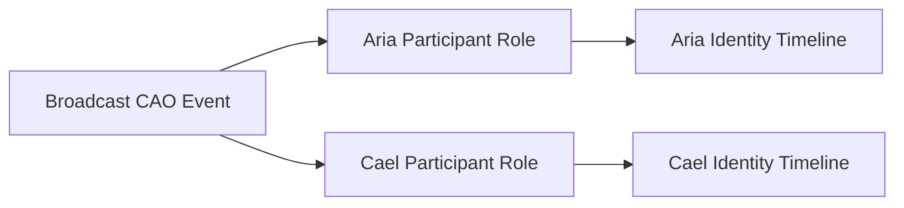

# Capability Contract — Agent Identity Timeline View

## Applicable Criteria

| Criterion | Why it applies |
|-----------|----------------|
| [active-exercise-grounding](../../planning/methodology/criteria/feature-capability-contract/active-exercise-grounding.md) | Every capability below maps only to narrative events where that capability is actively exercised. |
| [implementation-neutrality](../../planning/methodology/criteria/feature-capability-contract/implementation-neutrality.md) | The contract must stay in dashboard, identity, CAO event, and timeline domain language rather than implementation language. |
| [invariant-universality](../../planning/methodology/criteria/feature-capability-contract/invariant-universality.md) | The contract declares universal domain properties that apply across identity timelines and related-event views. |
| [stable-capability-ids](../../planning/methodology/criteria/feature-capability-contract/stable-capability-ids.md) | Downstream behavioral contracts and task slices need stable capability and invariant identifiers. |

## Capabilities

### CAP-1 — Identity Roster Browsing

The dashboard gives the operator an agents area where configured agent
identities are browsable as dashboard subjects. Narrative events that
exercise this capability: `E1`, `E2`, `E7`, `E10`.

### CAP-2 — Agent Identity View

The operator can open one agent identity and inspect that identity's
configured details together with its identity timeline. Narrative events
that exercise this capability: `E2`, `E7`, `E8`, `E10`.

### CAP-3 — Participant-Scoped Identity Timeline

An identity timeline presents recent CAO events involving the selected
agent identity, ordered by occurrence and summarized with event kind,
occurrence time, and the selected identity's participant role. Narrative
events that exercise this capability: `E3`, `E6`, `E7`, `E8`, `E9`.

### CAP-4 — Related Event Thread Exploration

The operator can expand a timeline row and see related CAO events through
that row's causation identifier or correlation identifier. Narrative
events that exercise this capability: `E4`, `E5`.

### CAP-5 — Broadcast Participant Viewpoints

A single broadcast CAO event can appear on each involved agent identity's
timeline while preserving the identity-specific participant role for the
view the operator is inspecting. Narrative events that exercise this
capability: `E6`, `E7`.

### CAP-6 — Live Timeline Refresh

The watched identity timeline updates while the operator remains on the
agent identity view, adding newly recorded CAO events involving that
identity without requiring a dashboard reload. Narrative events that
exercise this capability: `E8`.

### CAP-7 — Empty Identity Activity

The dashboard communicates when a configured agent identity has no recent
CAO events to display, distinct from loading or unreachable timeline
states. Narrative events that exercise this capability: `E10`.

## Invariants

### INV-1 — Agent Identity Independence

An agent identity remains a first-class dashboard subject independent of
which terminal, if any, currently manifests that identity.

### INV-2 — Participant-Index Timeline Membership

An identity timeline includes a CAO event for an agent identity only when
the event declares that identity as an agent participant, and the timeline
presents the participant role recorded for that identity.

### INV-3 — Canonical Event Identity

One CAO event remains one canonical durable event even when multiple
agent identities can reach it through their separate identity timelines.

### INV-4 — Envelope-Based Relatedness

Related event threads are formed from event envelope facts such as
causation identifiers and correlation identifiers, not from the typed body
of an event.

## Domain Graphs

```mermaid
flowchart LR
  Operator["Operator"] --> AgentsArea["Agents Area"]
  AgentsArea --> Roster["Agent Identity Roster"]
  Roster --> IdentityView["Agent Identity View"]
  IdentityView --> Timeline["Identity Timeline"]
  Timeline --> Participant["Agent Participant"]
  Participant --> CaoEvent["CAO Event"]
  CaoEvent --> Envelope["Event Envelope"]
  Envelope --> RelatedThread["Related Event Thread"]
```

