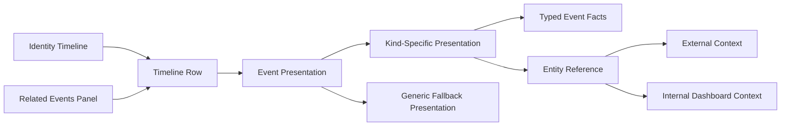

# Capability Contract — Agent Timeline Event Presentation

## Applicable Criteria

| Criterion | Why it applies |
|-----------|----------------|
| [active-exercise-grounding](../../planning/methodology/criteria/feature-capability-contract/active-exercise-grounding.md) | Every capability below maps only to narrative events where the capability is actively exercised. |
| [implementation-neutrality](../../planning/methodology/criteria/feature-capability-contract/implementation-neutrality.md) | The contract must stay in CAO event, identity timeline, presentation, and entity-reference domain language rather than implementation language. |
| [invariant-universality](../../planning/methodology/criteria/feature-capability-contract/invariant-universality.md) | The contract declares universal domain properties that apply across identity timeline event presentations. |
| [stable-capability-ids](../../planning/methodology/criteria/feature-capability-contract/stable-capability-ids.md) | Downstream behavioral contracts and task slices need stable capability and invariant identifiers. |

## Capabilities

### CAP-1 — Kind-Specific Timeline Event Presentation

An identity timeline can present a CAO event using details that belong to
that concrete typed event type instead of showing only event-envelope facts.
Narrative events that exercise this capability: `E1`, `E2`, `E3`, `E4`,
`E5`.

### CAP-2 — Related Event Presentation Continuity

The related events panel can present related CAO events with the same
event presentation those events would receive on the main identity
timeline. Narrative events that exercise this capability: `E6`, `E9`.

### CAP-3 — Entity Reference Navigation

The operator can follow entity references surfaced by event presentations
into the referenced external or internal context. Narrative events that
exercise this capability: `E7`, `E8`.

### CAP-4 — Generic Fallback Presentation

A CAO event whose kind has no taught event presentation remains visible
through a generic fallback presentation. Narrative events that exercise
this capability: `E9`.

## Invariants

### INV-1 — Presentation Truthfulness

An event presentation only represents facts carried by the CAO event and
the watched identity's participation in that event.

### INV-2 — Same-Context Presentation Consistency

Within one watched identity timeline context, the same CAO event receives
the same event presentation on the main timeline and in the related events
panel.

### INV-3 — Entity Reference Target Integrity

An entity reference names one target context and preserves whether that
target is external to CAO or internal to the CAO dashboard.

### INV-4 — Untaught Event Visibility

A CAO event whose kind has no taught event presentation remains visible
and related through the generic fallback presentation.

## Domain Graphs

