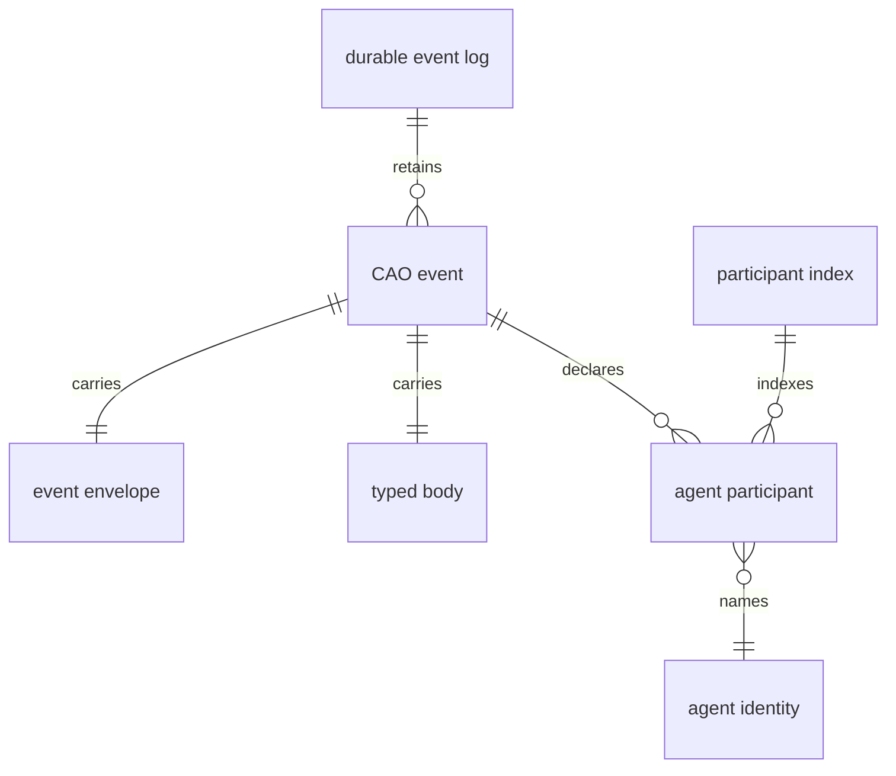

# Capability Contract - CAO-96 Durable Typed Event Log

Derived from the approved Feature Narrative at `narrative.md`. Domain
vocabulary remains canonical there.

## Applicable Criteria

| Criterion | Why it applies |
|-----------|----------------|
| [active-exercise-grounding](../../planning/methodology/criteria/feature-capability-contract/active-exercise-grounding.md) | Every capability maps to narrative events where the capability is actively exercised. |
| [implementation-neutrality](../../planning/methodology/criteria/feature-capability-contract/implementation-neutrality.md) | The contract must stay in CAO event-domain terms rather than storage, code, or payload mechanics. |
| [invariant-universality](../../planning/methodology/criteria/feature-capability-contract/invariant-universality.md) | The contract declares durable event-log invariants that must hold across all scenario branches. |
| [stable-capability-ids](../../planning/methodology/criteria/feature-capability-contract/stable-capability-ids.md) | Downstream behavioral contracts and tasks need stable capability and invariant IDs. |

## Capabilities

### CAP-1 - Durable Event History Readiness

The workspace can enter a state where production CAO events are retained
in a durable event log and agent involvement can be indexed. Narrative
events that exercise this capability: `E1`.

### CAP-2 - Production CAO Event Recording

Production CAO events published through the central publication path are
recorded with their event envelope, typed body, and declared agent
participants, including events with one participant, multiple
participants, or no participants. Narrative events that exercise this
capability: `E2`, `E3`, `E8`, `E9`.

### CAP-3 - Typed Event Reconstruction

A downstream consumer can ask for a recorded CAO event by event
identifier and receive the same concrete typed event that was originally
published, including its envelope, typed body, and participants. Narrative
events that exercise this capability: `E4`.

### CAP-4 - Agent-Scoped Event History

A downstream consumer can ask for CAO events involving a given agent
identity and receive only events that declare that agent as a participant,
in occurrence order. Narrative events that exercise this capability:
`E5`, `E8`, `E9`.

### CAP-5 - Envelope-Scoped Event Discovery

A downstream consumer can discover recorded CAO events through envelope
facts such as correlation identifier, causation identifier, event name,
or source, without depending on typed-body contents. Narrative events that
exercise this capability: `E6`, `E7`, `E9`.

### CAP-6 - Idempotent Event Republishing

When the same CAO event identifier is republished through the central
publication path, the durable event log and participant index continue to
represent one canonical CAO event and one canonical set of agent
involvements. Narrative events that exercise this capability: `E10`.

## Invariants

### INV-1 - Event Identifier Canonicality

Each event identifier names at most one canonical CAO event in the durable
event log.

### INV-2 - Recorded Event Reconstruction Fidelity

Every recorded CAO event retains enough envelope, typed-body, and
participant information to reconstruct the exact concrete typed event that
was published.

### INV-3 - Participant Index Represents Declared Involvement

The participant index represents only declared agent participants and
their roles for a recorded CAO event; events with no declared agent
participants have no participant-index entries.

### INV-4 - Envelope Facts Remain Queryable Independently

Envelope facts for recorded CAO events remain available for event-log
queries without requiring consumers to inspect typed bodies.

## Domain Graphs

